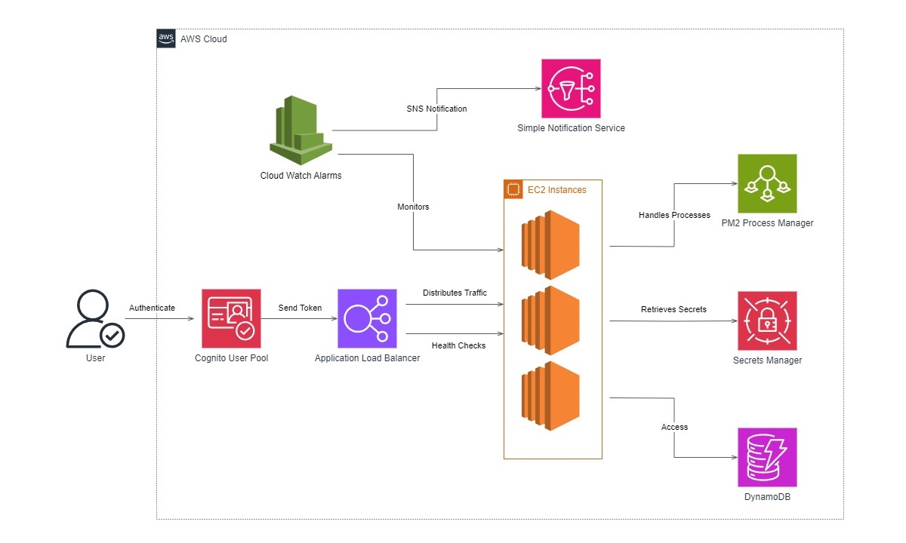

This is a data visualisation application that fetches data from aisstream.io api and displays the live information of ships on the the world map, using websocket to instantly update the information. AWS cognito is applied for user authentication.

# Online deployment: 
https://vessel-tracker-p9kq.onrender.com

# To run the project locally:
```sh
npm install
node server.js
change the mysql password to your own local mysql password
```

# Architechure diagram:

